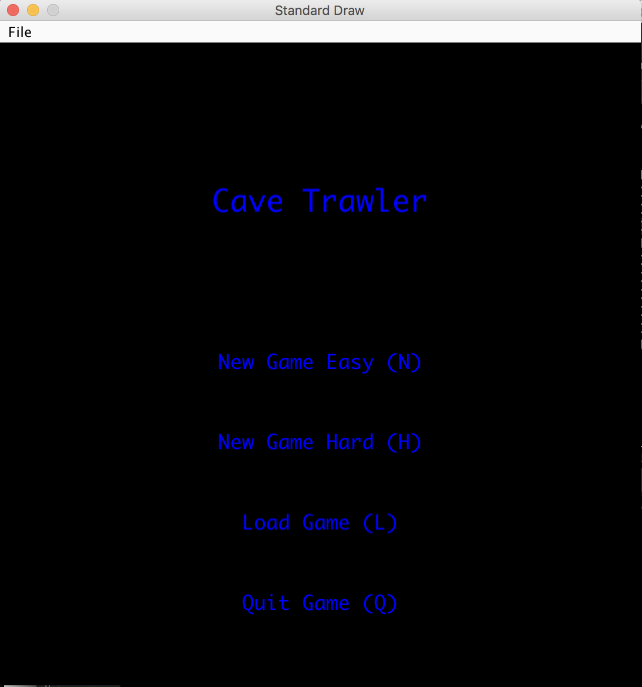
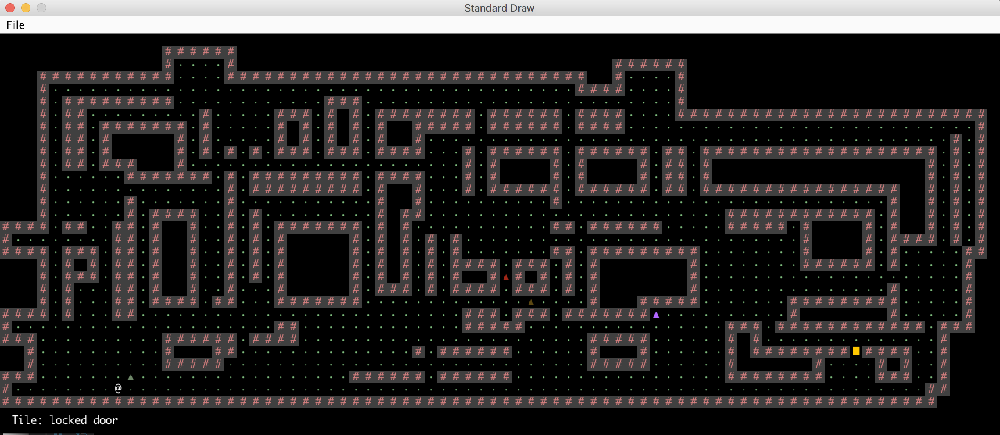
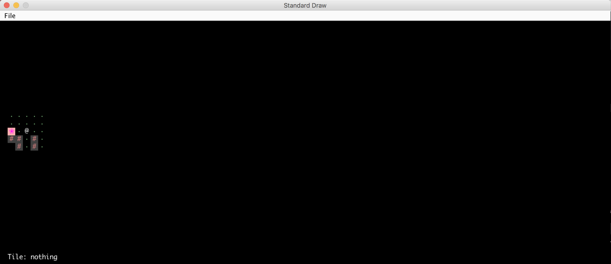

# CaveTrawler
A quick game I whipped up with a friend. There is an easy mode and a hard mode. 
 
## To Play:
<ol><li>Run Main.java</li>
  <li>Choose a game mode (hard or easy) or load a previous game.</li>
  <li>Enter a seed to generate a random world map</li>
  <li>Enjoy!</li>
</ol>
</img>
<h1><b>Easy Mode</b></h1>
</img>

The goal of the easy mode is to get your character (@) through the cave to the yellow locked door. However, there are enemy triangles that spawn every couple of moves that use a simple AI algorithm to chase your character down. There is also a 'hover' functionality which allows you to identify different tiles. Typing in :q allows you to quit out of the game while saving your progress. The next time you load up the game, you can press S to continue the game.

<h2><b>Hard Mode</b></h2>
</img>

The goal of the hard mode is to get your character (@) through the cave to the yellow locked door. However, there are enemy triangles that spawn every couple of moves that use a simple AI algorithm to chase your character down. So how is this different from the easy mode? Well, only a certain portion of the grid around you is illuminated at any given moment in time. In other words, you need to blindly move through the cave in hopes of finding the door. Meanwhile, the opponents are still trying to chase you down. There are light switch flowers which leave a small 8x8 grid around the flower permanently illuminated. Good luck and have fun! This mode has a 5% success rate. The hover functionality is also intact for this mode.

